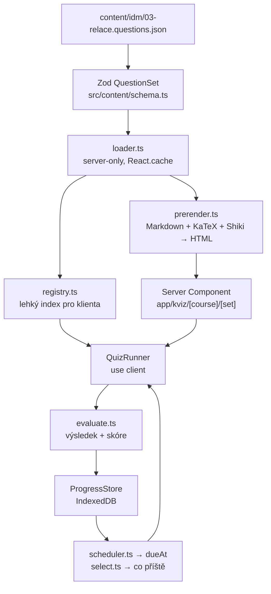

# Jak to je postavené

Poznámky pro mě za půl roku. Proč to takhle je, ne co který řádek dělá.

---

## Tři rozhodnutí, ze kterých plyne zbytek

1. **Obsah žije v gitu, ne v databázi.**
2. **Aplikace funguje bez přihlášení a bez serveru.** Přihlášení je nadstavba.
3. **Kvízy píšou AI agenti, ne člověk.** Schéma a kontroly jsou proto psané pro ně.

Všechno ostatní je důsledek.

---

## 1. Proč je obsah v gitu

Kvízy jsou JSON soubory v `content/<predmet>/*.questions.json`. Ne řádky v tabulce.

Důvody, v pořadí důležitosti:

- **Recenzovatelnost.** Otázky generuje model z přednáškových slidů. Model se plete.
  Když je obsah v gitu, je změna vidět v diffu, dá se komentovat a vrátit. V databázi
  by se špatná otázka objevila tiše a nikdo by nevěděl, kdy a proč vznikla.
  Proto taky existuje `status: "draft"` — dokud to člověk nepřečte, je to návrh.
- **Nasazení je jeden push.** Žádná migrace obsahu, žádné admin rozhraní, žádný krok
  „nezapomeň nahrát nová data". `npm run build` volá `content:check`, takže vadný
  obsah se prostě nenasadí.
- **Agent umí psát soubory.** Nástroj na výrobu kvízu je textový editor a `git commit`.
  Kdyby byl obsah v databázi, musel by existovat API endpoint, autentizace pro agenta
  a formulář na opravy. To všechno odpadlo.
- **Není co ztratit.** Obsah je v repozitáři u každého, kdo ho má naklonovaný.

Cena, kterou za to platím: **oprava překlepu vyžaduje nasazení**, a obsah se načítá
při buildu, ne za běhu. U hobby projektu s pár tisíci otázek je to výhodný obchod.

Uživatelský **pokrok** je přesný opak — mění se každou vteřinu a je osobní. Ten v gitu
být nemůže a není. Hranice mezi „obsah" a „pokrok" je proto i hranicí mezi git a úložištěm.

---

## 2. Cesta dat od souboru k obrazovce

### Čtyři soubory v `src/content/`, které to nesou

**`schema.ts`** — Zod schéma. Jediné místo, kde se rozhoduje, co je platná otázka.
Loader prožene JSON přes `QuestionSet.parse()` a odsud dál je obsah typovaný;
nikde jinde v aplikaci se už nekontroluje.

**`loader.ts`** — čtení z disku. **Jen pro Server Components a skripty** — sahá na
`node:fs`, v klientské komponentě to spadne už při buildu. Všechno je zabalené
v `React.cache`, aby se při jednom requestu nečetly stejné soubory dvakrát.

**`prerender.ts`** — tady je ta zajímavá část. Zadání otázek je Markdown s LaTeXem
a kódem; KaTeX i Shiki jsou velké knihovny, které mají běžet jen na serveru.
Jenže komponenta, která otázku obsluhuje, **musí** být klientská, protože drží stav
odpovědi. Řešení: server si Markdown přeloží do HTML dopředu a klient dostane hotové
řetězce, které jen vloží. Platím za to velikostí RSC payloadu, šetřím megabajt JS
v prohlížeči. Dobrý obchod.

**`registry.ts`** — lehký index (kam otázka patří, jaký má `materialHash`).
Klient ho potřebuje, když z IndexedDB vytáhne stav učení a chce zjistit, jestli se
otázka mezitím nezměnila. Schválně **neimportuje nic z `node:fs`**, takže se dá bez
obav použít v klientské komponentě.

### Kde se co vyhodnocuje

Odpověď se kontroluje **na klientu** (`src/lib/quiz/evaluate.ts`). Správné odpovědi
jsou součástí staženého obsahu a nic se neschovává — je to pomůcka na učení, ne zkouška.
Kdo se chce podívat do zdrojáku, ať se podívá; oklame jen sám sebe. Kdyby se
vyhodnocovalo na serveru, znamenalo by to request po každé otázce a offline režim by
přestal existovat.

Komponenta spočítá výsledek (`correct` / `partial` / `incorrect` / `skipped`, skóre 0–1)
a zavolá `recordAttempt()`. Tím pro ni práce končí — o tom, kdy se otázka objeví příště,
neví nic.

---

## 3. Ukládání pokroku

Celé úložiště je za jedním rozhraním: **`ProgressStore`** v `src/lib/progress/types.ts`.
Nic v aplikaci nesahá na IndexedDB ani na databázi přímo, všechno jde přes
`src/lib/progress/index.ts` a React vrstvu v `context.tsx`.

**Zápis je vždycky lokální.** Jediná implementace `ProgressStore` je
`LocalProgressStore` nad IndexedDB (Dexie). Žádný „serverový store" neexistuje —
a to je záměr: kdyby byly dvě implementace, lišily by se v detailech a chyby by se
projevovaly jen v jedné z nich.

Store je **singleton na kartu prohlížeče**. Dvě instance nad stejnou databází by si
navzájem přepisovaly stav otázek.

Na serveru IndexedDB není, takže při serverovém renderu je store `null` a hooky vrací
prázdné hodnoty. Skutečná data dorazí až po připojení — jinak by se rozešlo serverové
a klientské HTML.

### Datový model

Tři druhy záznamů, každý s jinou životností:

- **`AttemptRecord`** — jeden zodpovězený pokus. **Append-only, nikdy se needituje.**
  Surový log: kdy, jak to dopadlo, jak dlouho to trvalo, jestli byla použitá nápověda.
  Když se jednou rozhodnu změnit algoritmus opakování, dají se z něj stavy přepočítat.
- **`QuestionState`** — odvozený stav učení jedné otázky (streak, ease, interval,
  `dueAt`, mastery). Právě tohle čte plánovač. Dá se zahodit a spočítat znovu z pokusů.
- **`DayStats`** — denní souhrn pro sérii dnů a graf aktivity. Cache, nic víc.

### Synchronizace se serverem

Po přihlášení klient pošle svůj **`ProgressSnapshot`** na `POST /api/progress/sync`.
Server ho slije se svým a vrátí výsledek zpátky; obě strany pak mají totéž.

Slučování je **last-write-wins podle `updatedAt`, po jednotlivých záznamech**.
Žádné slučování polí napůl — z dvou konzistentních stavů by vznikl jeden nesmyslný.

Je to primitivní a v jistém smyslu špatně: kdyby někdo odpovídal na dvou zařízeních
naráz, jeden pokus by se ztratil. Pro jednoho studenta, který přesedá z notebooku
na telefon, je to ale úplně jedno — a jakékoli chytřejší řešení (CRDT, merge přes
append-only log) by stálo dny práce, které jsou lépe utracené jinde. Kdyby to začalo
vadit, cesta vede přes ten log pokusů; k tomu koneckonců je.

`exportAll()` / `importAll()` dělají totéž ručně, přes soubor. Záchranná cesta pro
přenos mezi zařízeními bez přihlášení — a moje záloha.

### Přihlášení

better-auth, e-mail a heslo, tabulky přes Drizzle v Neon Postgres. Zapíná se
**přítomností `DATABASE_URL`**; bez ní přihlašovací stránky jen vysvětlí, že
přihlašování není nastavené, a zbytek webu funguje dál.

Jediné registrační pravidlo je **e-mail z domény VUT** (`src/lib/auth/vut.ts`).
Ta funkce schválně nemá žádné závislosti, protože běží na třech místech: u políčka
v prohlížeči (rychlá zpětná vazba), v hooku na serveru (skutečná obrana) a v testech.
Tři implementace téhož pravidla by se dřív nebo později rozešly.

---

## 4. Co se ukáže příště

### `scheduler.ts` — kdy

Varianta **SM-2** (algoritmus z Ankiho a spol.). Každá otázka má koeficient snadnosti
`ease` (1,3–3,0) a interval ve dnech. Po úspěchu jde interval 1 den → 6 dní → dál se
násobí `ease`, strop je rok. Po neúspěchu spadne na začátek a `ease` se sníží —
otázka, kterou člověk opakovaně plete, se vrací častěji. `dueAt` je pak
`lastSeenAt + intervalDays`.

Klasické SM-2 se ptá uživatele „jak ti to šlo" (Again / Hard / Good / Easy). Tady se
nikdo neptá — nikdo nemá chuť klikat sebehodnocení po každé otázce. Známku 0–5, kterou
SM-2 potřebuje, proto **odvozuju**: správnost dá základ, rychlost vzhledem k odhadnuté
době čtení ho posune nahoru nebo dolů, vyžádaná nápověda ho srazí. Správně s nápovědou
po dvaceti vteřinách ≠ správně za tři vteřiny.

### `select.ts` — co

Trénink není náhodný výběr. Session se míchá v pevném poměru: **50 % po splatnosti**
(páteř opakování), **20 % slabiny** i když ještě nejsou splatné, **25 % nové**
(bez nich se člověk nikam neposune) a **5 % kontrolní vzorek zvládnutých**, ať nezmizí
z dohledu. Když některá skupina nemá dost položek, dobírá se podle priority
`due → weak → fresh → mastered`.

### `mastery.ts` — jak to vypadá

`mastery` (`nova`, `ucim-se`, `skoro`, `zvladnuta`, `slabina`) je **odvozený štítek**,
nikdy se neukládá ručně. Je to jediná věc z celého algoritmu, kterou uživatel vidí —
`ease: 2.36` nikomu nic neřekne. Signál slabiny nese `lapses`: kolikrát člověk otázku
uměl a pak ji zase zapomněl.

### Tři režimy

| Režim | Co vybírá |
|---|---|
| `procvicovani` | Otázky z jedné sady, po pořádku. Průchod materiálem |
| `chyby` | Jen to, co bylo naposledy špatně. Vysoké `lapses` napřed |
| `trenink` | Namíchaná session přes celý předmět podle poměrů výše |

---

## 5. Dva hashe, ne jeden

V `src/content/hash.ts` jsou dvě funkce a rozdíl mezi nimi je zásadní:

| | Odpovídá na otázku | K čemu |
|---|---|---|
| `contentHash(q)` | Změnilo se **cokoli**? | Invalidace cache předrenderovaného HTML |
| `materialHash(q)` | Změnil se **význam**? | Invalidace naučeného stavu |

Oprava překlepu ve vysvětlení nebo přeházení možností **nesmí** uživateli shodit
streak u otázky, kterou už umí. Změna správné odpovědi ano — tam je naučený stav
najednou k ničemu, protože člověk uměl něco jiného.

Hash je čistě JS (FNV-1a, 64 bitů), ne SHA-256 z `node:crypto`. Schválně: stejný kód
musí projít na serveru i v prohlížeči, kde `node:crypto` není, a dvě implementace by
se rozešly. Shodu s referenční BigInt variantou hlídá test.

Druhá půlka téhle smlouvy je, že **`id` otázky se nikdy nemění**. Pro autory obsahu
je to popsané v [`AUTHORING.md`](AUTHORING.md), sekce 7, včetně `formerIds` pro případ,
kdy to opravdu nejde jinak.

---

## 6. Co tu schválně není

- **Vlastní editor otázek.** Editor je textový soubor plus `npm run content:check`.
  Web na psaní kvízů by byl větší projekt než samotné kvízy.
- **Skóre, žebříčky, odznaky.** Jediné číslo, které má smysl, je „kolik toho umím",
  a to už na obrazovce je.
- **Chytrá synchronizace.** Viz sekce 3 — vědomé rozhodnutí, ne opomenutí.
- **Vyhodnocování na serveru.** Nemá koho chránit a zabilo by offline režim.
- **`nodemailer` v závislostech.** SMTP transport existuje, ale balíček si doinstaluješ,
  až ho budeš chtít. Většina lidí nebude.
- **i18n.** Web je česky a bude česky. Řetězce jsou proto přímo v komponentách;
  kdyby to někdy mělo být jinak, je to práce na odpoledne a nemá cenu ji dělat předem.
